---
# try also 'default' to start simple
theme: default
# random image from a curated Unsplash collection by Anthony
# like them? see https://unsplash.com/collections/94734566/slidev
background: /assets/images/cover.png
# apply any windi css classes to the current slide
class: "text-center"
# https://sli.dev/custom/highlighters.html
highlighter: shiki
# show line numbers in code blocks
lineNumbers: true
# some information about the slides, markdown enabled
info: |
    ## Slidev Starter Template
    Presentation slides for developers.

    Learn more at [Sli.dev](https://sli.dev)
# persist drawings in exports and build
drawings:
    persist: false
---

# Web worker

Comment comprendre Web worker avec une histoire facile

<style>
h1 {
  position: absolute;
  top: 1rem;
  left: 20rem;
  color: #2980b9;
  text-transform: uppercase;
}
h1 + p {
  position: absolute;
  top: 6rem;
  left: 13rem;
  color: #3498db;
  font-size: 1.5rem;
}
.cover {
  background-image: url('/assets/images/cover.png') !important;
  background-size: contain !important;
}
</style>

---

# Je vais vous raconter l'histoire du petit Nicolas et de son père

Qu'est ce que fait son père dans sa famille:

-   📝 **Écouter** - toutes les demandes de sa femme et son fils
-   🎨 **Planifier** - tout les voyages
-   🧑‍💻 **Construire** - la maison
-   🤹 **Dessiner** - tout les murs
-   🎥 **Appeler** - des amis pour organiser les soirées
-   📤 **Envoyer** - des cartes postales aux grand-parents
-   🛠 **Réparer** - ce qui a été dans la maison


<!--
You can have `style` tag in markdown to override the style for the current page.
Learn more: https://sli.dev/guide/syntax#embedded-styles
-->

---

# Et il existe une journée

Le père du petit Nicolas est trop occupé avec son travail, il n'a plus de temps pour sa femme et son fil. Il est temps de partager!

```mermaid
sequenceDiagram
  Maman->Papa: N'oublie pas d'acheter un bouquet de fleur
  Papa->Maman: Mais je me suis s'occupé
  Papa->Nicolas: Peux-tu m'aider?
  Nicolas->Papa: Oui, papa!
```




---

# Quel est le rapport avec notre sujet d'aujourd'hui?

On remplace `père` par `main thread`, et on recommence avec ce contexte:

Main thread, qu'est ce qu'il fait dans notre navigateur:

-   📝 **Écouter** - tout les évenements sont déclenchés par notre application et chercher qui les interesse
-   🎨 **Planifier** - comment gérer les résources
-   🧑‍💻 **Construire** - l'arbre de DOM
-   🤹 **Dessiner** - appliquer les styles (CSS)
-   🎥 **Appeler** - requêtes pour remplir notre app avec des données en réel
-   📤 **Envoyer** - les demandes à Web API comme geolocation, notification,...etc
-   🛠 **Réparer** - l'appel qui a échoué

<!--
You can have `style` tag in markdown to override the style for the current page.
Learn more: https://sli.dev/guide/syntax#embedded-styles
-->

---
layout: image-right
image: /assets/images/solution.png
---

# Quel est le problème et comment les Web workers nous aident ?

Aujourd'hui, avec l'évolution des technologies, le main thread gère beaucoup de tâches, et Javascript est un langage _single thread_, il ne peut pas faire deux tâches en même temps.

Par contre, nos CPUs ont aussi évolués, ils ont plus que un coeurs ❤️, pourquoi ne pas en profiter ?

---
layout: image-left
image: /assets/images/action.png
---

# Worker in action

```js {2|3|4-6|9|10|11|12|all}
// main.js
const worker = new Worker("worker.js");
worker.postMessage(someMessage);
worker.onmessage = (message) => {
	// traiter message
};

// worker.js
onmessage = function (e) {
	const data = e.data;
	const workerResult = doSomethingWithData(data);
	postMessage(workerResult);
};
```

<style>
.grid.grid-cols-2 .w-full {
  background-size: contain !important;
}
</style>

---

# Démo avec Vanilla JS


---

# Questions ?


---

# Merci beaucoup pour votre attention!

